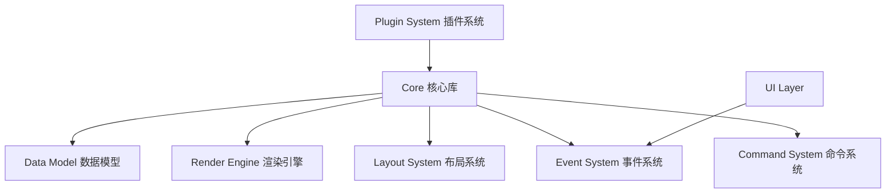

# 详细设计文档 (Design Document)

> 基于 Brainstorm Session 整理

## 1. 总体架构 (Architecture Overview)

Holy Sheet 采用分层解耦的架构设计，核心层负责数据与渲染，业务层通过插件系统扩展。



---

## 2. 数据模型 (Data Model)

核心包结构设计目标为 `< 60KB (gzipped)`。

### 2.1 单元格数据结构 (CellData)
为了节省内存，采用极简的接口设计。

```typescript
interface CellData {
  v?: CellValue          // value: 原始值 (string | number | boolean | null)
  s?: StyleId | CellStyle // style: 样式ID引用 或 内联样式对象
  f?: string             // formula: 公式文本 "=SUM(A1:A10)"
  t?: CellType           // type: 强制类型 (n=number, s=string, b=boolean, d=date, e=error)
  si?: string            // shared formula id: 共享公式ID
  p?: RichTextData       // rich text: 富文本数据
  custom?: Record<string, unknown> // 插件扩展数据
}
```

### 2.2 工作簿与工作表 (Workbook & Sheet)
*   **Workbook**: 管理 Sheets、全局样式表 (`StylePool`)、元数据。
*   **Sheet**:
    *   **数据存储**: 使用稀疏矩阵结构 `Record<number, Record<number, CellData>>` 存储单元格数据。
    *   **行列配置**: `rowHeights`, `colWidths` 存储自定义尺寸，提供默认值。
    *   **合并单元格**: `MergeCell[]` 列表存储。

### 2.3 样式系统 (Style System)
*   **StylePool**: 共享样式池，将重复样式提取为 ID，减少内存占用。
*   支持 **ID 引用** 和 **内联样式** 双模式。

---

## 3. 渲染系统 (Render System)

参考 Univer 等高性能表格引擎的绘制技术。

### 3.1 分层架构 (Layered Architecture)
渲染层分为三层，从下到上：
1.  **Main Layer (Canvas)**: 绘制网格线、单元格背景、内容、边框。使用脏矩形重绘。
2.  **Selection Layer (Canvas)**: 绘制选区、拖拽高亮、填充柄。独立 Canvas，频繁重绘。
3.  **DOM Layer**: 处理事件捕获、输入框 (`<input>`)、滚动容器 (`<div>`)。

### 3.2 渲染优化技术
*   **批量绘制 (Batch Draw)**: 使用 `Path2D` 按颜色分组批量绘制单元格背景。
*   **网格线优化**: 先绘制完整网格线，再通过 `clearRect` 清除合并单元格区域内部线条。
*   **脏矩形 (Dirty Rect)**: 追踪变动区域，仅重绘受影响的单元格。
*   **滚动优化**: 使用 `globalCompositeOperation: 'copy'` 实现 Canvas 像素平移，仅绘制新进入视口的区域。

### 3.3 Worker 策略
*   **Phase 1**: 主线程渲染，Worker 处理公式计算、排序、筛选等纯数据计算。
*   **Phase 2**: 探索 OffscreenCanvas，将渲染循环移至 Worker，主线程仅做合成。

---

## 4. 布局系统 (Layout System)

负责行列映射与坐标计算，支持动态行高列宽和隐藏行列。

### 4.1 索引映射 (Index Mapping)
采用 **逻辑索引映射法** 处理插入/删除行列后的索引变化。
*   **Segment**: 分段存储逻辑索引与物理索引的对应关系。
*   **IndexMapper**: 提供 `toPhysical(logical)` 和 `toLogical(physical)` 转换，复杂度 O(log k)。

### 4.2 累积偏移缓存 (Accumulator Cache)
加速像素坐标与行列索引的转换。
*   **分块缓存**: 每 N 行（如 1000 行）为一个块，缓存块的起始高度。
*   **查询**: 二分查找块 + 块内线性查找。复杂度 O(log b + blockSize)。
*   **懒更新**: 修改行高时仅标记 Dirty，下次查询时增量重建。

---

## 5. 交互与事件系统 (Event & Interaction)

### 5.1 事件总线 (Event Bus)
*   统一管理 DOM 事件（鼠标、键盘、触摸、滚动）。
*   派发标准化的业务事件：`cell:click`, `selection:change`, `edit:start` 等。

### 5.2 交互状态机 (Interaction State Machine)
明确当前交互状态，避免逻辑冲突。
*   States: `Idle`, `Selecting` (选择中), `RowResizing`/`ColResizing` (调整大小), `Filling` (填充), `Editing` (编辑中)。

### 5.3 选区与编辑
*   **SelectionManager**: 管理单选、多选、区域扩展（Shift+Click）、合并单元格自动扩展。
*   **CellEditor**: 处理 IME 输入合成、公式编辑模式，支持命令合并（连续输入合并为一个 Undo 操作）。
*   **AutoScroller**: 拖拽至边缘时触发自动滚动。

---

## 6. 命令系统 (Command System)

实现 Undo/Redo 和操作事务。

### 6.1 Command 结构
```typescript
interface Command<T = unknown> {
  type: string
  payload: T
  undo?: UndoData
}
```

### 6.2 CommandDispatcher
*   **事务 (Transaction)**: 支持 `beginTransaction`, `commit`, `rollback`。
*   **命令合并**: 短时间（如 300ms）内对同一单元格的连续修改合并为一个命令，优化撤销体验。
*   **钩子 (Hooks)**: `before` 和 `after` 钩子，供插件拦截或响应操作。

---

## 7. 插件系统 (Plugin System)

基于钩子的扩展机制。

### 7.1 Plugin 接口
```typescript
interface Plugin {
  manifest: { name: string, version: string }
  // 生命周期
  onInstall(ctx): void
  onWorkbookCreate(ctx, workbook): void
  // 钩子
  onCellGet(ctx, pos, data): CellData  // 修改读取数据
  onCellSet(ctx, pos, data): CellData  // 修改写入数据
  onBeforeCommand(ctx, cmd): boolean   // 拦截命令
  onCellRender(ctx, info): void        // 自定义渲染
  onKeyDown(ctx, e): boolean           // 快捷键处理
  // ... 更多交互钩子
}
```

### 7.2 核心插件
1.  **Clipboard**: 处理剪贴板事件，支持 Excel 格式互通。
2.  **Formula**: 解析公式字符串，构建依赖图，计算结果。
3.  **History**: 提供撤销/重做栈管理。
