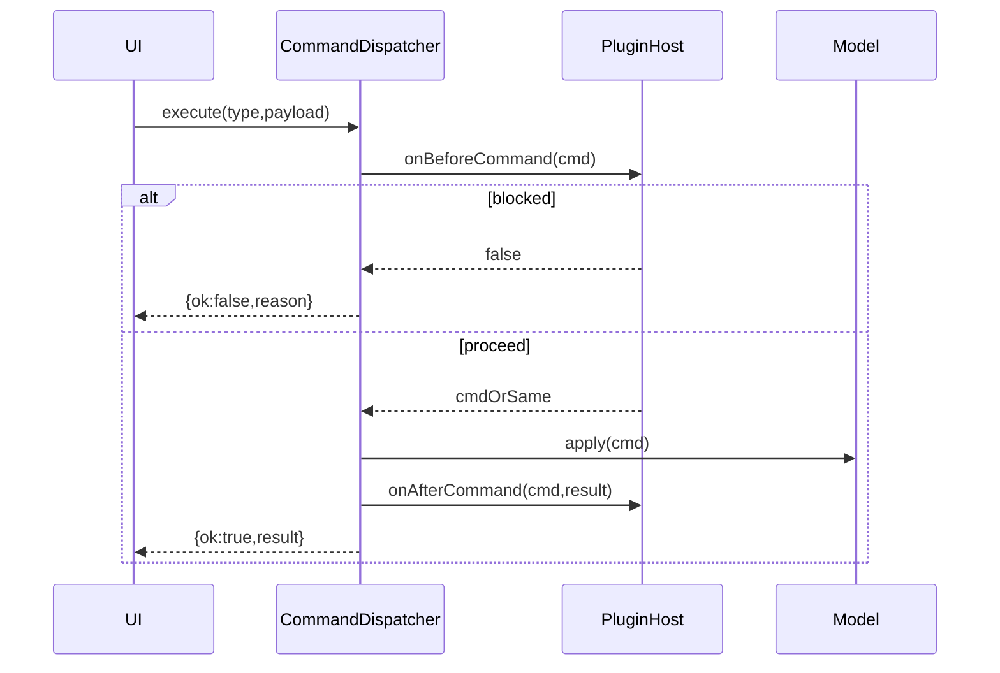

## Holy Sheet：设计规格说明（Design Spec）

> 版本：1.0
> 更新日期：2026-01-12
> 参考来源：[`../../docs/brainstorm-session.md`](../../docs/brainstorm-session.md)、[`../../docs/technical-roadmap.md`](../../docs/technical-roadmap.md)、[`../../docs/development-plan.md`](../../docs/development-plan.md)
> 路线与里程碑：[`roadmap-and-goals.md`](roadmap-and-goals.md)
> 阶段任务拆解：[`phases-and-tasks.md`](phases-and-tasks.md)

## 1. 设计目标与约束

### 1.1 目标

- **性能优先**：百万级数据渲染与交互仍可用（滚动 60fps、增量重绘）。
- **核心克制**：复杂能力通过插件实现，`@holy-sheet/core` 体积与内存可控。
- **高扩展性**：为未来报表能力、更多插件类型、Worker/OffscreenCanvas 留足扩展点。
- **框架无关**：核心以 DOM + Canvas 为宿主，不绑定 React/Vue 等框架。

### 1.2 关键约束（必须遵守）

- 核心体积目标：`@holy-sheet/core` **< 60KB gzip**（预算见 `roadmap-and-goals.md`）。
- 渲染架构：**分层 Canvas + 脏矩形增量渲染**，滚动优先走复用路径。
- 数据结构：**稀疏存储**（`Record<number, Record<number, CellData>>`），避免全量矩阵常驻。
- 插件模型：默认**同步钩子**、按注册顺序执行；不做沙箱隔离。

## 2. 总体架构

### 2.1 包结构（Monorepo）

推荐结构（与路线图对齐）：

```
packages/
├── core/           # @holy-sheet/core：数据/布局/渲染/交互/命令/插件
├── formula/        # @holy-sheet/formula：公式解析与计算（插件）
├── clipboard/      # @holy-sheet/clipboard：复制/剪切/粘贴（插件）
├── xlsx/           # @holy-sheet/xlsx：xlsx 导入导出（插件）
└── playground/     # 调试与性能基准场
```

### 2.2 Core 模块边界（`@holy-sheet/core`）

```
core/
├── model/          # Workbook/Sheet/CellData/StylePool/MergeIndex
├── layout/         # IndexMapper/AccumulatorCache/HiddenRanges/LayoutManager
├── render/         # Viewport/LayerManager/DirtyRect/SheetRenderer
├── event/          # EventEmitter/EventManager/Selection/Interaction
├── command/        # CommandDispatcher/Handlers/Undo/Transaction
└── plugin/         # Plugin/Manifest/PluginManager/PluginContext/hooks
```

### 2.3 运行时分层（DOM + Canvas）

- **DOM Layer**：事件捕获、输入控件（单元格编辑器）、滚动容器。
- **Selection Canvas**：选区/拖拽/高亮等高频重绘内容（独立画布）。
- **Main Canvas**：网格线 + 单元格背景 + 文本/富文本 + 边框（脏矩形重绘）。

## 3. 核心数据模型（model）

### 3.1 基础约定

- 行列索引：**0-based**（第 0 行第 0 列对应 A1）。
- 单元格地址：`{ row, col }`，范围：`{ sr, sc, er, ec }` 均为闭区间。
- 数据与渲染分离：model 只描述数据；render 只消费 view-range 与可渲染信息。

### 3.2 CellData（轻量 + 可扩展）

```typescript
type CellValue = string | number | boolean | null
type CellType = 'n' | 's' | 'b' | 'd' | 'e'  // number/string/boolean/date/error
type StyleId = number

interface RichTextData {
  runs: TextRun[]
}
interface TextRun {
  t: string
  s?: TextStyle
}
interface TextStyle {
  ff?: string
  fs?: number
  fc?: string
  b?: boolean
  i?: boolean
  u?: boolean
  s?: boolean
}

interface CellStyle {
  ff?: string
  fs?: number
  fc?: string
  b?: boolean
  i?: boolean
  u?: boolean
  s?: boolean
  ha?: 'left' | 'center' | 'right'
  va?: 'top' | 'middle' | 'bottom'
  ta?: number
  tw?: boolean
  bg?: string
  bd?: { t?: BorderStyle; r?: BorderStyle; b?: BorderStyle; l?: BorderStyle }
  nf?: string
}
interface BorderStyle {
  s: 'thin' | 'medium' | 'thick' | 'dashed' | 'dotted' | 'double'
  c: string
}

interface CellData {
  v?: CellValue
  s?: StyleId | CellStyle
  t?: CellType
  f?: string
  si?: string
  p?: RichTextData
  custom?: Record<string, unknown> // 插件扩展字段（核心不解释）
}
```

设计要点：
- **稀疏性**：空单元格不分配对象；只有被写入的格子进入 `cellData`。
- **样式双模式**：既支持 `StyleId`（共享）也支持内联 `CellStyle`（便于导入与局部覆盖）。
- **可插拔**：`custom` 仅作为扩展点，核心不假设结构。

### 3.3 Workbook / Sheet

```typescript
interface WorkbookMeta {
  name?: string
  author?: string
  createdAt?: number
  modifiedAt?: number
}

class Workbook {
  sheets: Map<string, Sheet>
  sheetOrder: string[]
  activeSheetId: string
  styles: Record<StyleId, CellStyle>  // 共享样式表
  metadata: WorkbookMeta
}

interface FreezeConfig { row: number; col: number }
interface SheetMeta { tabColor?: string; hidden?: boolean }

interface MergeCell { sr: number; sc: number; er: number; ec: number }

class Sheet {
  id: string
  name: string
  cellData: Record<number, Record<number, CellData>>
  merges: MergeCell[]
  rowHeights: Record<number, number>
  colWidths: Record<number, number>
  defaultRowHeight: number
  defaultColWidth: number
  rowCount: number
  colCount: number
  frozen: FreezeConfig | null
  metadata: SheetMeta
}
```

### 3.4 StylePool（共享样式池）

目标：在不引入引用计数的前提下，实现样式复用与去重，降低内存。

- **输入**：`CellStyle`（内联样式对象）
- **输出**：`StyleId`（数字 ID），Workbook 全局共享表 `styles[StyleId]`
- **策略**：
  - 使用稳定序列化（如 key 排序后的 JSON）计算 hash key，做去重
  - 支持“样式合并”（例如局部覆盖 bg/ha 等）
  - 提供 `resolve(style: StyleId | CellStyle): CellStyle` 供渲染侧消费

### 3.5 MergeIndex（合并单元格索引）

需求：高效判断某格是否在合并区域内，并支持按视口范围查询。

```typescript
class MergeIndex {
  private merges: MergeCell[] = []
  private rowIndex: Map<number, MergeCell[]> = new Map()

  getMergeAt(row: number, col: number): MergeCell | null
  isMasterCell(row: number, col: number): boolean
  isSlaveCell(row: number, col: number): boolean
  getMergesInViewport(sr: number, er: number, sc: number, ec: number): MergeCell[]
}
```

约定：
- **Master cell**：`(sr, sc)`；其余为 slave cell。
- 渲染时：
  - 网格线先全画，再对合并区域内部用 `clearRect` 清除内部线条
  - 内容绘制只在 master cell 处绘制一次（并按合并后的宽高排版）

## 4. 布局系统（layout）

### 4.1 核心问题

布局系统负责：行高/列宽、插入删除、隐藏、以及 **像素坐标 ↔ 行列索引** 的高效映射（虚拟滚动的基础）。

### 4.2 IndexMapper（逻辑索引映射）

目的：在插入/删除行列后，保持“逻辑索引”稳定，同时用分段映射降低更新成本。

```typescript
interface Segment {
  logicalStart: number
  physicalStart: number
  count: number
}

class IndexMapper {
  private segments: Segment[] = [{ logicalStart: 0, physicalStart: 0, count: Infinity }]
  toPhysical(logical: number): number   // O(log k)
  toLogical(physical: number): number   // O(k)
  insert(at: number, count: number): void  // O(k)
  delete(at: number, count: number): void  // O(k)
  compact(): void
}
```

### 4.3 AccumulatorCache（累积偏移缓存）

目的：快速计算某一行/列的累计偏移（例如第 n 行的 y 坐标），并支持局部失效增量重建。

关键点：
- 以 `BLOCK_SIZE = 1000` 分块缓存累计高度/宽度
- 查询复杂度：`O(log b + blockSize)`（二分块 + 块内扫描）

### 4.4 HiddenRanges（隐藏行列）

目标：在“少量隐藏”与“批量隐藏”两种场景下自适应。

- `< THRESHOLD(100)`：`Set<number>` 存储
- `>= THRESHOLD`：压缩为区间数组 `Array<[start, end]>`

### 4.5 LayoutManager（统一接口）

```typescript
class LayoutManager {
  // 查询
  getRowHeight(row: number): number
  getColWidth(col: number): number
  getRowOffset(row: number): number
  getColOffset(col: number): number
  getCellAtPoint(x: number, y: number): { row: number; col: number }
  getVisibleRange(scroll: { x: number; y: number }, size: { w: number; h: number }): {
    sr: number; er: number; sc: number; ec: number
  }

  // 修改
  setRowHeight(row: number, height: number): void
  setColWidth(col: number, width: number): void
  insertRows(at: number, count: number): void
  deleteRows(at: number, count: number): void
  hideRows(rows: number[]): void
  showRows(rows: number[]): void

  // 事务（批量更新，减少重复失效）
  beginTransaction(): void
  endTransaction(): void
}
```

复杂度预期（核心用来做性能预算）：
- 获取行高/列宽：`O(log k)`
- 获取偏移：`O(log b + blockSize)`
- 像素→行列：`O(log b + blockSize)`（二分 + 块内线性）
- 插入/删除：`O(k)`（只更新映射段）

## 5. 渲染系统（render）

### 5.1 Viewport（虚拟滚动）

Viewport 负责：根据滚动位置与容器尺寸计算可视范围（含 buffer），并输出给渲染器。

关键输出：
- `viewRange = { sr, er, sc, ec }`
- `scroll = { x, y }`
- 滚动方向与 delta（供 copy 平移与局部重绘策略使用）

### 5.2 分层渲染（Layering）

```
DOM Layer（事件捕获/输入/滚动）
Selection Canvas（选区/拖拽反馈，高频重绘）
Main Canvas（网格 + 内容 + 边框，脏矩形重绘）
```

原则：
- Selection Layer 重绘频繁，必须与 Main Layer 解耦。
- Main Layer 尽量避免全量重绘，优先脏矩形/滚动复用。

### 5.3 SheetRenderer：绘制流程（已确认）

```typescript
draw(ctx, bound) {
  // 1. 绘制网格线
  this.drawGridLines(ctx, bound)
  // 2. 清除合并单元格内部的网格线
  this.clearMergeGridLines(ctx, bound)
  // 3. 绘制单元格背景（Path2D 批量）
  this.drawBackgrounds(ctx, bound)
  // 4. 绘制单元格内容（文本/富文本/错误等）
  this.drawContents(ctx, bound)
  // 5. 绘制边框
  this.drawBorders(ctx, bound)
}
```

### 5.4 Path2D 批量绘制（减少 draw call）

策略：
- 按颜色/样式分组：例如 `fillStyle` 相同的背景合并进同一个 `Path2D`
- 对象池：重用 `Path2D`，避免频繁分配造成 GC 抖动

### 5.5 DirtyRect：脏矩形增量重绘（已确认）

核心思想：
- 维护“需要重绘的矩形列表”
- 滚动时优先使用 `globalCompositeOperation: 'copy'` 平移已有像素
- 只重绘新增暴露区域（例如向下滚动时只补画底部条带）

### 5.6 文本渲染与测量缓存

建议缓存项：
- 字体字符串 `fontKey = ff/fs/b/i` → `ctx.font`
- `measureText(text, fontKey)` 结果缓存（按 LRU/上限控制）

## 6. 事件与交互系统（event）

### 6.1 EventEmitter（事件总线）

```typescript
class EventEmitter {
  on<T>(event: string, callback: (data: T) => void): () => void
  once<T>(event: string, callback: (data: T) => void): () => void
  emit<T>(event: string, data: T): void
  off(event: string, callback?: (data: unknown) => void): void
}
```

### 6.2 EventManager（DOM 绑定与归一化）

职责：
- 绑定 `mousedown/move/up/dblclick/contextmenu`、`keydown/keyup`、`wheel/scroll`、触摸事件
- 统一坐标系：把鼠标/触摸坐标转换到“表格内容坐标”（扣除容器偏移与滚动）
- 把 DOM 事件翻译为内部事件（如 `cell:click`、`selection:change` 等）

### 6.3 交互状态机（InteractionManager）

```typescript
type InteractionState =
  | { type: 'idle' }
  | { type: 'selecting', start: {row:number;col:number}, current: {row:number;col:number} }
  | { type: 'rowResizing', row: number, startY: number, startHeight: number }
  | { type: 'colResizing', col: number, startX: number, startWidth: number }
  | { type: 'filling', selection: {sr:number;sc:number;er:number;ec:number}, direction: 'up'|'down'|'left'|'right' }
  | { type: 'editing', pos: {row:number;col:number} }
```

### 6.4 SelectionManager（选区模型）

能力：
- `setRange / addRange / extendTo`
- `move(deltaRow, deltaCol, extend)`（键盘导航）
- `expandForMerge(selection)`（合并单元格扩展）

### 6.5 AutoScroller（拖拽边缘自动滚动）

关键参数：
- `EDGE_THRESHOLD = 50`
- `BASE_SPEED = 10`
- `MAX_SPEED = 50`

### 6.6 CellEditor（IME 输入处理，已确认）

约束：
- 维护 `isComposing` 状态
- `compositionstart/update/end` 期间 Enter/Escape 语义与“提交/取消候选词”需区分
- 与命令合并窗口协同：连续输入（300ms 内）合并为单次撤销步骤

### 6.7 ContextMenu（右键菜单）

- 内置菜单项：cut/copy/paste、插入/删除行列、合并/取消合并、清除等
- 插件扩展：支持分组、插入位置、基于 referenceId 的相对定位

## 7. 命令系统（command）

### 7.1 命令模型

```typescript
interface Command<T = unknown> {
  type: string
  payload: T
  undo?: unknown
}
```

内置命令集合（核心对齐路线图）：`SET_CELL/SET_CELLS/CLEAR_CELLS`、行列插入删除、隐藏显示、合并拆分、样式设置、工作表管理等。

### 7.2 CommandDispatcher（执行、合并、历史、事务）

关键能力：
- `execute(type, payload)`：执行并返回结果
- `undo/redo`：历史栈（默认 100 步）
- `beginTransaction/commit/rollback`：批量操作原子化
- **命令合并窗口**：同一单元格连续输入在 `mergeWindow=300ms` 内合并
- hooks：before/after（供插件/内部扩展介入）

### 7.3 命令执行链路（示意）



## 8. 插件系统（plugin）

### 8.1 设计原则

- 插件是“一等公民”：公式/剪贴板/xlsx 都以插件实现
- 同步钩子：保持核心简单，避免引入复杂调度（后续可扩展异步）
- 无优先级：按注册顺序执行（需要优先级时再引入）

### 8.2 Plugin 接口（对齐 brainstorm）

```typescript
interface PluginManifest {
  name: string
  version: string
  description?: string
  dependencies?: string[]
}

interface Plugin {
  manifest: PluginManifest

  // 生命周期
  onInstall?(ctx: PluginContext): void
  onUninstall?(ctx: PluginContext): void
  onWorkbookCreate?(ctx: PluginContext, workbook: unknown): void

  // 数据钩子
  onCellGet?(ctx: PluginContext, pos: {row:number;col:number}, data: unknown): unknown | null | void
  onCellSet?(ctx: PluginContext, pos: {row:number;col:number}, data: unknown): unknown | false

  // 命令钩子
  onBeforeCommand?(ctx: PluginContext, cmd: unknown): unknown | false
  onAfterCommand?(ctx: PluginContext, cmd: unknown, result: unknown): void

  // 渲染钩子
  onCellRender?(ctx: PluginContext, info: unknown): unknown | void

  // 交互钩子
  onCellClick?(ctx: PluginContext, e: unknown): boolean
  onCellDblClick?(ctx: PluginContext, e: unknown): boolean
  onCellContextMenu?(ctx: PluginContext, e: unknown): boolean
  onSelectionChange?(ctx: PluginContext, e: unknown): void
  onEditStart?(ctx: PluginContext, e: unknown): boolean
  onEditEnd?(ctx: PluginContext, e: unknown): void
  onKeyDown?(ctx: PluginContext, e: unknown): boolean
  onKeyUp?(ctx: PluginContext, e: unknown): boolean
  onScroll?(ctx: PluginContext, e: unknown): void
  onViewportChange?(ctx: PluginContext, viewport: unknown): void
}
```

> 注：这里 `unknown` 是为了表达“类型在 core 内部会收敛成明确的类型定义”，而不是最终实现建议。

### 8.3 返回值约定（关键：决定插件可组合性）

- **可拦截类钩子**（返回 `false` 表示阻止默认行为/后续链路）：
  - `onCellSet`：返回 `false` 阻止写入；返回修改后的 data 表示替换写入内容
  - `onBeforeCommand`：返回 `false` 阻止命令；返回新 cmd 表示替换命令
  - `onEditStart / onKeyDown / onCellClick ...`：返回 `true` 表示“已处理/阻止默认行为”
- **可变换类钩子**（返回新对象表示变换结果）：
  - `onCellGet`：返回 `CellData|null` 表示覆盖读取结果；返回 `void` 表示不干预
  - `onCellRender`：返回新 `CellRenderInfo` 表示变换渲染输入

### 8.4 PluginManager / PluginContext

PluginManager：
- 安装/卸载插件（含依赖检查）
- 维护插件列表与执行顺序

PluginContext：
- 提供对核心能力的受控访问：`workbook/commands/events/layout/selection`
- 提供插件私有状态存储：`getState/setState(pluginName,key,value)`

## 9. Worker 演进路线（Phase 7）

### 9.1 Phase 1：Worker 只做数据计算

- 公式计算、排序/筛选、可能的文本测量预处理（可选）
- 主线程负责渲染与交互

### 9.2 Phase 2（可选）：OffscreenCanvas Worker 渲染

- Worker 完成 Main Layer 绘制，主线程只做合成与事件
- 需要特性检测与降级策略（不支持时回退 Phase 1）

## 10. 测试与基准（质量门槛）

- 单元测试（Vitest）：
  - model：稀疏读写、样式池去重、合并索引边界
  - layout：像素→行列映射、插入/删除/隐藏的一致性
  - command：撤销/重做、事务、命令合并
- E2E（Playwright）：
  - 滚动/选择/编辑/IME/右键菜单
  - 大数据场景下的交互稳定性
- 性能基准（playground）：
  - 100 万单元格加载、持续滚动、批量粘贴、公式刷新等场景

