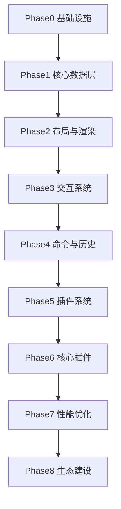

## Holy Sheet：开发路线与目标（Roadmap & Goals）

> 版本：1.0
> 更新日期：2026-01-12
> 参考来源：[`../../docs/brainstorm-session.md`](../../docs/brainstorm-session.md)、[`../../docs/technical-roadmap.md`](../../docs/technical-roadmap.md)、[`../../docs/development-plan.md`](../../docs/development-plan.md)

## 1. 项目定位

Holy Sheet 是一个 **基于 Canvas 的高性能电子表格开源库（框架无关）**，目标是在浏览器端提供接近 Excel 的数据模型与交互体验（不含图表），并通过插件体系实现可扩展能力（公式、剪贴板、xlsx 导入导出等）。

### 1.1 核心目标

- **高性能渲染**：面向百万级数据量的稳定滚动与增量重绘。
- **高扩展性**：核心保持克制，复杂能力以插件实现（公式、xlsx、历史面板等）。
- **轻量体积**：核心包 `@holy-sheet/core` 目标 **< 60KB gzip**；整体核心能力（不含重插件）目标 **< 100KB gzip**。
- **低内存占用**：稀疏存储 + 共享样式池 + 视口化渲染与缓存策略。
- **可演进架构**：支持未来扩展报表/更多插件类型；并为 Worker/OffscreenCanvas 路线预留接口。

### 1.2 范围边界（In Scope / Out of Scope）

- **In Scope**
  - Excel 风格的数据模型（Workbook/Sheet/CellData/样式/合并/冻结等）
  - Canvas 渲染（分层、脏矩形、滚动复用、Path2D 批量绘制）
  - 完整交互（选择、编辑、键盘/触摸、右键菜单、IME）
  - 命令系统（撤销/重做、事务、命令合并）
  - 插件系统（生命周期、数据/命令/渲染/交互钩子）
  - 核心插件：剪贴板、公式、xlsx、历史（可选 UI）
- **Out of Scope（当前阶段明确不做）**
  - 图表、数据透视表等高级报表能力
  - 协同编辑/多人实时（只预留命令序列化等扩展点）
  - 条件格式 / 数据验证（暂不对标）
  - 插件沙箱隔离（默认不限制插件能力）

## 2. 阶段总览（Phase 0-8）

### 2.1 依赖关系总览图

### 2.2 各阶段目标与交付物（摘要）

> 详细任务拆解见：[`phases-and-tasks.md`](phases-and-tasks.md)

| Phase | 目标 | 关键交付物（最小集合） |
|------:|------|------------------------|
| 0 | 工程化与基础设施就绪 | Monorepo、构建/测试/CI、文档框架、playground |
| 1 | 核心数据层（可用可测） | Workbook/Sheet/CellData、StylePool、MergeIndex、基础测试 |
| 2 | 布局与渲染（只读可滚动） | LayoutManager、Viewport、SheetRenderer、分层 Canvas、DirtyRect |
| 3 | 交互系统（可选可编辑） | EventManager、Interaction 状态机、Selection、CellEditor(IME)、ContextMenu |
| 4 | 命令与历史（可撤销） | CommandDispatcher、Undo/Redo、Transaction、命令合并窗口 |
| 5 | 插件系统（可扩展） | Plugin/Manifest/Manager/Context、钩子调用链与返回值约定 |
| 6 | 核心插件（常用能力） | clipboard / formula / history / xlsx（均以插件形式） |
| 7 | 深度性能优化 | Worker 计算、文本/字体缓存、Path2D 对象池、OffscreenCanvas 可选 |
| 8 | 生态建设与 1.0 | API 文档、教程/示例、框架适配（React/Vue）、开发者工具 |

## 3. 里程碑（Milestones）

| 里程碑 | 覆盖 Phase | 对外可演示能力（验收口径） |
|-------:|------------|----------------------------|
| M0 | 0 | 项目可构建、可测试、可在 playground 运行基础 demo |
| M1 | 1-2 | **静态表格（只读）**：可加载数据并流畅滚动；渲染正确（含合并单元格） |
| M2 | 3-4 | **可交互可编辑**：选择/编辑/键盘导航/IME；命令驱动数据变更；撤销重做可用 |
| M3 | 5-6 | **可扩展 + 常用插件可用**：插件钩子稳定；剪贴板/公式/xlsx 跑通主路径 |
| M4 | 7 | **高性能版本**：大数据/复杂交互保持目标指标；引入 Worker/缓存体系 |
| M5 | 8 | **1.0 发布**：文档完善、示例齐备、框架适配与生态入口稳定 |

## 4. 关键指标与测量口径

### 4.1 性能目标

- **首屏渲染**：< 50ms（可视区初始化 + 首次绘制完成）。
- **滚动帧率**：稳定 60fps（持续滚动 5s，掉帧可接受阈值需定义并记录）。
- **百万单元格加载**：< 1s（数据构建 + 首次可交互）。
- **交互响应**：大范围选择、拖拽、自动滚动保持 60fps。

### 4.2 内存目标

- **100 万单元格内存占用**：< 200MB（以稀疏存储为主，避免“全量矩阵”常驻）。

### 4.3 体积目标

- **`@holy-sheet/core`**：< 60KB gzip（核心模块合计预算见 5.1）。
- **整体目标**：核心能力（不含重插件）< 100KB gzip。

### 4.4 兼容性与质量目标

- **浏览器**：以现代 Chromium/Firefox/Safari 为主；触摸设备按 Phase 3 纳入。
- **稳定性**：关键路径（渲染、命令、编辑）需具备单测；交互主路径有 E2E。

## 5. 体积预算与模块分摊

### 5.1 核心包体积预算（gzip）

| 模块 | 预算 |
|------|------|
| model/ | 8KB |
| layout/ | 6KB |
| render/ | 15KB |
| event/ | 10KB |
| command/ | 5KB |
| plugin/ | 4KB |
| utils/ | 4KB |
| 其他 | 8KB |
| **合计** | **< 60KB** |

### 5.2 插件体积策略（原则）

- **公式/xlsx**：允许相对更大体积，默认按“按需安装/按需打包”对待。
- **核心不内置重逻辑**：核心提供接口与生命周期，能力通过插件实现。

## 6. Worker 与渲染演进路线

- **Phase 7（Phase 1）**：主线程渲染，Worker 负责数据计算（公式、排序、筛选等）。
- **Phase 7（Phase 2，可选）**：OffscreenCanvas 在 Worker 内渲染，主线程只做合成；需做特性检测与降级路径。

## 7. 技术风险与缓解

| 风险 | 影响 | 缓解措施 |
|------|------|----------|
| Canvas 渲染瓶颈 | 大数据卡顿 | 分层渲染、脏矩形、copy 平移、Path2D 批量、离屏缓存 |
| 公式引擎复杂度 | 兼容不足/性能差 | 插件化、渐进实现、优先常用函数、依赖追踪与增量计算 |
| 内存占用过高 | 崩溃/GC 抖动 | 稀疏存储、共享样式池、视口外策略、缓存上限与回收 |
| 跨浏览器差异 | 行为不一致 | 特性检测、最小 Polyfill、E2E 覆盖关键交互 |
| 触摸/IME 交互细节 | 体验差/难维护 | 独立 TouchHandler 与 CellEditor 组合输入状态管理 |

## 8. 文档导航（本目录）

- 路线与目标（本文）：[`roadmap-and-goals.md`](roadmap-and-goals.md)
- 设计规格：[`design-spec.md`](design-spec.md)
- 阶段计划与任务：[`phases-and-tasks.md`](phases-and-tasks.md)

